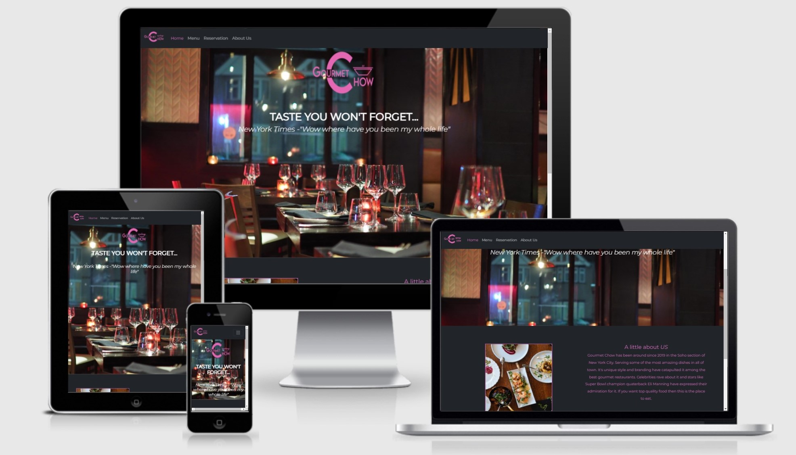

# [Chow Chow](https://champion316.github.io/Gourmet-Chow/) 🍜 a gourmet restaurant

A gourmet restaurant with an extravagant menu located in lower manhattan. 

## Table of contents

- [Description](#1-description)
- [UX](#2-gameplay)
- [Technologies used](#3-technologies-used)
- [Testing](#4-testing)
- [Improvements](#5-improvements)
- [Deployment](#6-deployment)
- [Credits](#7-credits)
- [Acknowledgments](#8-acknowledgments)

## 1 Description 

Chow Chow is a fictional restaurant located in NYC that serves gourmet food for expensive prices. It specializes in steak. The name comes from the cute dog breed "Chow Chow" which is where the play on words comes from. 

## UX

### 1.1 Project Goals 

This website was designed so that a user can book an appointment at the restaurant on a specific date and time with ease of use. Easy to navigate across all devices and good readability. 

### 1.2 User Stories 

- As a user, I expect to navigate the website with ease of use.
- As a user, I expect to find the food menu as fast as possible.
- As a user, I expect to find the restaurants phone number as fast as possible. 
- As a user, I expect to find the restaurants address as fast as possible.
- As a user, I expect to book a table with a number of guests. 
- As a user, I expect to cancel my booking if plans change before hand. 
- As a user, I expect to be able to download the menu as a pdf if possible. 
- As a user, I expect to combine multiple tables if we have more than the guest limit for bookings. 

---

##  2 Features 

### 2.1 Existing Features

All of my pages consist of the same navigation menu bar or hamburger icon for mobile devices. This format allows the user to understand where everything is located at all times for simplicity. The main page has a footer at the bottom with the address, phone number, and social media links. (I am currently working on whether the footer will be implemented on all pages except the menu page.) My color palette was created using [https://coolors.co/](https://coolors.co/). I decided to use 3 colors listed below in RGB format. 

The color palette was done using [coolors](https://coolors.co/) as seen by the image here [collage](readme-files/chow-color-palette.png)

At this point in time I only have the index.html page running but will implement the rest as I just worked on the wireframes for the rest of the site. 

[**The Navbar**](wireframes/navbar.png) includes:

- **Home Page**: allows the user to navigate to the main page.
- **Menu Page**: allows the user to view the food menu.
- **Reservation Page**: allows the user to place a reservation with a date and time.
- **About Us Page**: allows the user to learn more about the restaurant and it's history.

[**The Header**](wireframes/navbar.png) : Contains an image of the inside of a restaurant that I got form [pexels](https://www.pexels.com/photo/wine-glasses-on-table-tops-941861/) which is a website that allows users to use images for free. 

[**Section**](wireframes/navbar.png) : Contains a colored background with an image of a dish that the restaurant serves with a brief description about the restaurant. 

[**The Footer**](wireframes/navbar.png) : includes:

- **Address details**: includes a contact email to contact the owner.
- **Phone Number**: newsletter so clients can stay up to date with new material and more.
- **Social Media Links**: Links to the restaurants social media pages. 

### 2.2. Features left to implement in the future

- Add sections that will separate the videos as the libray grows by dates and categories.
- Be able to submit the form and receive a confirmation when signing up for the newsletter.
- Add a featured page for testimonials on clients that have experienced positive changes.
- Add a section with testimonials and customer reviews.